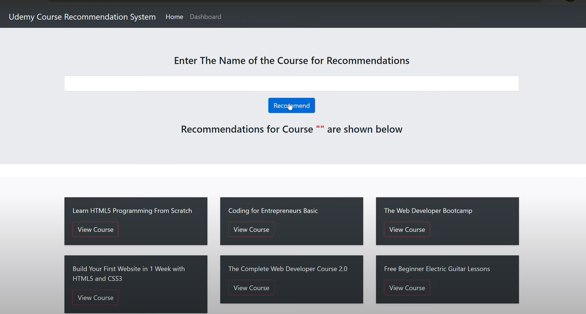

# Recommendation-system

## Overview
The Udemy Course Recommendation System is a Python-based web application built with Flask that helps users find relevant courses based on their topics of interest

### Demo Video

